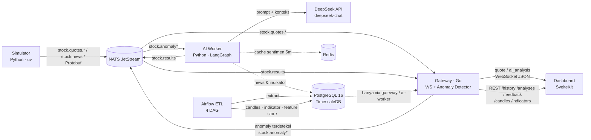

# EquiSentinel

Sistem pemantauan dan analitik pasar saham **real-time** berbasis event-driven. EquiSentinel memakai Agen AI otonom sebagai "Analis Keuangan Pribadi" yang mendeteksi anomali harga, menarik konteks berita finansial terkait, lalu memberikan analisis sentimen terstruktur langsung di dashboard.

Ketika terjadi pergerakan harga yang tidak wajar pada suatu emiten (mis. saham anjlok drastis atau volume meledak), sistem otomatis mengkorelasikan data teknikal dengan berita terbaru dan menyimpulkan apakah anomali didorong faktor teknikal, sentimen pasar, atau aksi korporasi.

> **Penting:** seluruh data (harga, berita) berasal dari **simulator**, bukan feed pasar nyata. Proyek ini ditujukan untuk pembelajaran/eksperimen, bukan keputusan investasi.

---

## Fitur Utama

- **Simulator data pasar** (Python) — tick OHLCV berbasis *Geometric Brownian Motion* untuk 5 emiten BEI (BBCA, BBRI, TLKM, ASII, GOTO), lengkap dengan skenario anomali terjadwal (price crash/spike, volume spike) yang disertai berita terkait.
- **Deteksi anomali real-time** (Go) — price change > 3% dalam 1 menit **atau** volume > 5× rata-rata 20 menit, dengan debouncing 30 detik dan kanal terpisah untuk anomali kritis (> 5%).
- **Agen AI (LangGraph)** — state machine: cek teknikal → ambil konteks berita (PostgreSQL/NATS) → konteks indikator teknikal → reasoning ke DeepSeek → output terstruktur (sentiment + risk level), dengan cache Redis 5 menit.
- **Dashboard real-time** (SvelteKit) — grafik candlestick live via WebSocket, kartu analisis AI, feedback human-in-the-loop (ACCURATE/INACCURATE), dan halaman **analitik historis** (`/analytics`) dengan indikator teknikal.
- **Layer ETL (Airflow)** — agregasi candle 1m/5m/1h, kalkulasi SMA/EMA/RSI/Bollinger Bands, gap filling, dan feature store untuk analitik historis — berjalan paralel tanpa mengganggu jalur real-time.

---

## Arsitektur



Empat tahap alur data:

1. **Ingestion** — Simulator → NATS (`stock.quotes.*`, `stock.news.*`)
2. **Routing & deteksi** — Gateway → WebSocket (visual) + `stock.anomaly` (analitik) + persist ke PostgreSQL
3. **Analisis AI** — AI Worker (LangGraph) → DeepSeek → `stock.results`
4. **Pelaporan** — Gateway → dashboard via WebSocket + simpan ke PostgreSQL

---

## Tech Stack

| Komponen | Teknologi |
|---|---|
| Data ingestion | Python 3.12, `uv`, Protocol Buffers |
| Message broker | NATS JetStream (stream: `STOCK_QUOTES`, `STOCK_NEWS`, `STOCK_ANOMALY`, `STOCK_RESULTS`) |
| Gateway & orchestrator | Go (WebSocket, anomaly detector, REST API) |
| Storage | PostgreSQL 16 + TimescaleDB (hypertable), Redis (cache) |
| AI Engine | Python, LangGraph, LangChain, DeepSeek API, Pydantic |
| Frontend | SvelteKit (runes), Tailwind CSS 4, TradingView Lightweight Charts |
| ETL (Fase 4) | Apache Airflow 3, pandas, SQLAlchemy |

Kontrak data antar service didefinisikan lewat Protobuf di `proto/` (`StockQuote`, `NewsArticle`, `AnomalyEvent`, `AiAnalysis`) dan di-generate ulang dengan `make proto`.

---

## Struktur Repository

```
.
├── docker-compose.yml        # NATS, gateway, simulator, postgres, redis, ai-worker, etl
├── Makefile                  # up/down/migrate/proto/test
├── .env.example              # template variabel environment
├── docs/                     # arsip perencanaan (PROJECT_PLAN.md, catatan as-built Fase 4)
├── proto/                    # definisi Protobuf untuk semua kontrak data
├── migrations/               # SQL migration (0001–0010), dijalankan via `make migrate`
├── simulator/                # Python — generator data + skenario anomali (uv project)
├── gateway/                  # Go — API Gateway, WebSocket, anomaly detector, REST
├── ai-worker/                # Python — LangGraph + DeepSeek (uv project)
├── dashboard/                # SvelteKit — dijalankan lokal, tidak dikontainerisasi
└── etl/                      # Python — Airflow DAG + health server (uv, src layout)
```

---

## Prasyarat

- Docker + Docker Compose
- Node.js 22+ (untuk dashboard)
- `uv` (untuk pengembangan service Python lokal)
- Go 1.26+ (untuk pengembangan gateway lokal)
- API key DeepSeek (untuk analisis AI; tanpa key, AI worker tetap berjalan dengan analisis fallback)

---

## Quick Start

```bash
# 1. Persiapkan environment
cp .env.example .env
# isi DEEPSEEK_API_KEY di .env

# 2. Jalankan semua service (kecuali dashboard)
make up

# 3. Apply migration (stock_prices, news_articles, anomaly_events,
#    ai_analyses, user_feedback + tabel warehouse candles_*/technical_indicators/feature_store_ai)
make migrate

# 4. Jalankan dashboard secara lokal
cd dashboard
npm install
npm run dev
# buka http://localhost:5173
```

Simulator otomatis memulai skenario anomali (crash GOTO ~30 detik, volume spike TLKM ~90 detik, rally BBCA ~150 detik) sehingga anomali + analisis AI muncul di dashboard dalam beberapa menit pertama.

### Password Airflow (UI ETL)

Airflow 3 memakai **Simple Auth Manager**; password admin disimpan di file (bukan dicetak ulang di log):

```bash
docker compose exec etl cat /app/airflow_home/simple_auth_manager_passwords.json.generated
```

Atau cek di log run pertama: `docker compose logs etl | grep -i password`. UI: `http://localhost:8090` (user: `admin`).

---

## Port & Endpoint

| Port | Service | Endpoint |
|---|---|---|
| 8080 | Gateway HTTP | `/ws`, `/health`, `/history`, `/analyses`, `/feedback`, `/candles`, `/indicators`, `/indicators/summary` |
| 8081 | AI Worker health | `/health` |
| 8082 | Simulator health | `/health` |
| 8083 | ETL health | `/health` |
| 8090 | Airflow webserver | `/` |
| 5173 | Dashboard (dev) | `/` (monitor), `/analytics` |

Endpoint REST gateway (satu-satunya jalur akses PostgreSQL dari luar):

```bash
# Histori harga & analisis (Fase 1–3)
GET /history?ticker=BBCA&limit=500
GET /analyses?ticker=BBCA&limit=200
POST /feedback                        # {"correlationId": "...", "feedbackValue": "ACCURATE"}

# Data warehouse analitik (Fase 4)
GET /candles?ticker=BBCA&interval=1m&limit=500      # interval: 1m | 5m | 1h
GET /indicators?ticker=BBCA&interval=1m&limit=500   # SMA/EMA/RSI/Bollinger
GET /indicators/summary?interval=1m                 # indikator terbaru per emiten
```

WebSocket `/ws` mengirim envelope JSON `{"type": "quote" | "ai_analysis", "data": {...}}`.

---

## Konfigurasi (Environment)

Referensi lengkap di `.env.example`. Yang utama:

| Variabel | Default | Keterangan |
|---|---|---|
| `DEEPSEEK_API_KEY` | — | API key DeepSeek (wajib untuk analisis LLM) |
| `PRICE_CHANGE_THRESHOLD_PCT` | `3.0` | Ambang perubahan harga (%) per 1 menit |
| `VOLUME_RATIO_THRESHOLD` | `5.0` | Ambang rasio volume vs rata-rata 20 menit |
| `CRITICAL_PRICE_CHANGE_PCT` | `5.0` | Ambang anomali kritis (subject `stock.anomaly.critical`) |
| `DEBOUNCE_WINDOW_SECONDS` | `30` | Window debounce per emiten+trigger |
| `CANDLE_INTERVAL_SECONDS` | `2` | Interval candle simulator |
| `TICKS_PER_CANDLE` | `5` | Tick per candle simulator |
| `WAREHOUSE_DATABASE_URL` | (kosong → sama dengan `DATABASE_URL`) | Koneksi warehouse terpisah (opsional) |
| `ETL_HTTP_PORT` | `8083` | Port health server ETL |

Ticker dan skenario simulator dikonfigurasi di `simulator/config/tickers.yaml` dan `simulator/config/scenarios.yaml`.

---

## Database

Migration (`make migrate`) membuat tabel berikut:

**Transaksional (real-time)**
- `stock_prices` — OHLCV per candle (hypertable, indeks `ticker, timestamp`)
- `news_articles` — arsip berita finansial simulasi
- `anomaly_events` — riwayat anomali (trigger_type, price_change_pct, volume_ratio, critical, correlation_id)
- `ai_analyses` — hasil analisis LangGraph (sentiment, risk level, model, latency)
- `user_feedback` — feedback human-in-the-loop per correlation_id

**Warehouse (Fase 4, analitik)**
- `candles_1m`, `candles_5m`, `candles_1h` — agregasi OHLCV per interval (hypertable)
- `technical_indicators` — SMA, EMA, RSI, Bollinger Bands per interval
- `feature_store_ai` — snapshot fitur per emiten (JSONB) untuk konteks AI

---

## Layer ETL (Fase 4)

Airflow menjalankan 4 DAG yang membaca tabel transaksional dan menulis ke tabel warehouse:

| DAG | Jadwal | Fungsi |
|---|---|---|
| `candle_aggregation` | setiap 5 menit | Agregasi `stock_prices` → `candles_1m/5m/1h` |
| `technical_indicators` | setiap 10 menit | Hitung SMA/EMA/RSI/Bollinger dari candle (dengan **gap filling**) |
| `data_quality` | setiap jam | Deteksi anomali OHLC, outlier, dan gap (log warning saja) |
| `feature_store` | setiap 15 menit | Snapshot indikator terbaru per emiten → `feature_store_ai` |

- Kode ETL berbentuk package `etl/src/etl` (extract/transform/load) yang di-import langsung oleh DAG.
- Transform memakai **pandas**; cleaning berupa `fill_gaps` (forward-fill harga, volume 0) dan deteksi outlier (tidak menghapus data warehouse karena candle anomali adalah sinyal utama sistem).
- Health server ETL (`/health`) mengecek koneksi ke source DB dan warehouse, berjalan berdampingan dengan `airflow standalone` lewat `etl.entrypoint`.

---

## Dashboard

- **Halaman utama `/`** — grafik candlestick live, marker anomali/analisis AI, kartu analisis terbaru, tombol feedback (Akurat / Tidak Akurat). Histori dipulihkan via server load (REST gateway), update real-time via WebSocket.
- **Halaman `/analytics`** — pilih emiten & interval (1m/5m/1h): candlestick + overlay SMA/EMA/Bollinger, panel RSI (garis 70/30), dan tabel perbandingan indikator antar emiten.

Dashboard tidak pernah terhubung langsung ke PostgreSQL — semua data lewat REST gateway.

---

## Alur Analisis AI (LangGraph)

Untuk setiap `AnomalyEvent`:

```
technical_check → context_retrieval → technical_context → llm_reasoning → structured_output
```

1. **technical_check** — jika data tidak signifikan (price & volume 0), langsung output analisis default.
2. **context_retrieval** — ambil berita emiten 30 menit terakhir dari PostgreSQL; fallback ke stream NATS `stock.news.*`.
3. **technical_context** — baca indikator teknikal terbaru per interval dari warehouse (`technical_indicators`).
4. **llm_reasoning** — prompt ke DeepSeek dengan konteks harga, berita, dan indikator; hasil di-cache Redis 5 menit per emiten.
5. **structured_output** — validasi Pydantic → publish `stock.results`.

`correlation_id` (UUID) menghubungkan quote → anomali → hasil analisis → feedback sepanjang pipeline.

---

## Testing

```bash
make test                # semua service
make test-gateway        # go test ./...
make test-simulator      # uv run pytest
make test-ai-worker      # uv run pytest
make test-etl            # uv run pytest
make test-dashboard      # npx vitest run
make test-integration    # docker compose up + migrate + full-stack test (ai-worker)
```

CI (`.github/workflows/ci.yml`) menjalankan test + type-check untuk gateway, simulator, ai-worker, etl, dan dashboard di setiap push/PR.

---

## Observability

- **Logging** — `structlog` (Python), `zerolog` (Go), event-style (mis. `anomaly_detected`).
- **Health checks** — tiap service punya `/health` (NATS/DB/DeepSeek reachability, queue depth, koneksi source/warehouse).
- **LangSmith** (opsional) — aktifkan via `LANGSMITH_TRACING=true` + `LANGSMITH_API_KEY` untuk melacak alur agen, latensi per state, dan token usage.

---

## Batasan & Catatan

- Data harga/berita adalah **simulasi** — bukan data pasar nyata.
- Tidak ada autentikasi pada dashboard (proyek lokal single-user).
- Tanpa `DEEPSEEK_API_KEY`, pipeline tetap berjalan dengan analisis fallback (sentiment NEUTRAL, risk LOW).
- Komponen opsional yang sengaja tidak diimplementasikan (tercatat di `docs/PROJECT_PLAN.md` §13.6): dbt, pgbouncer, integrasi API eksternal historis, laporan periodik.
